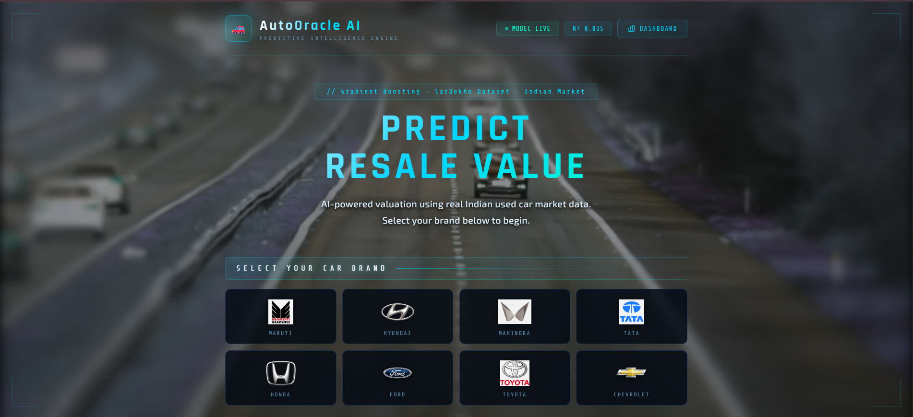
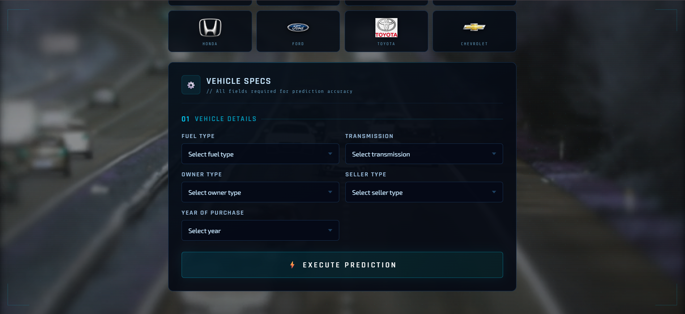
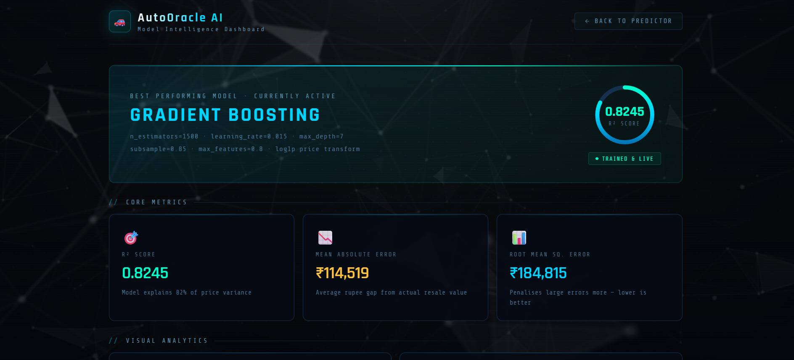

# AutoOracle AI

<div align="center">


**An AI-powered used car resale price prediction engine built for the Indian automotive market.**  
Trained on real CarDekho data using a fine-tuned Gradient Boosting model achieving an R² of ~0.83.

[Live Demo](#) · [Report Bug](#) · [Request Feature](#)

</div>

---

## Table of Contents

- [Project Demo](#project-demo)
- [Overview](#overview)
- [Features](#features)
- [Tech Stack](#tech-stack)
- [Project Structure](#project-structure)
- [Getting Started](#getting-started)
- [Model Architecture](#model-architecture)
- [Application Routes](#application-routes)
- [Supported Brands](#supported-brands)
- [Contributing](#contributing)
- [License](#license)

---

## Project Demo

### Home Interface


### Vehicle Specifications Form


### AI Price Prediction


### Model Dashboard


### Analytics & Feature Importance


---

## Overview

**AutoOracle AI** is a full-stack machine learning web application that predicts the resale value of used cars in India. Users input vehicle details — brand, model, fuel type, transmission, ownership history, year of purchase, and kilometres driven — and receive an instant AI-generated price estimate powered by a Gradient Boosting Regressor.

The application also features a dedicated **Model Intelligence Dashboard** (`/teacher`) where the ML pipeline, performance metrics, feature importance, and algorithm comparisons are visualised in real time.

---

## Features

- 🎯 &nbsp;**Accurate Predictions** — Gradient Boosting model with R² ≈ 0.83 on held-out test data
- 🚗 &nbsp;**8 Major Indian Brands** — Maruti, Hyundai, Mahindra, Tata, Honda, Ford, Toyota, Chevrolet
- 📊 &nbsp;**Live Model Dashboard** — Visualise R² score, MAE, RMSE, feature importance, and algorithm comparisons
- ⚡ &nbsp;**Real-time Inference** — Sub-second predictions via a Flask REST endpoint
- 🎨 &nbsp;**Futuristic HUD UI** — Cinematic dark interface with animated car slider, brand showcase, and confidence bar
- 🔁 &nbsp;**Feature Engineering** — 6 engineered features including `car_age`, `km_per_year`, `km_age_ratio`, and more
- 🧠 &nbsp;**Log-transform Target** — Price predicted in log-space (`log1p` / `expm1`) for improved accuracy on skewed distributions

---

## Tech Stack

| Layer | Technology |
|---|---|
| **Backend** | Python 3.10+, Flask 3.0.3 |
| **ML / Data** | scikit-learn 1.5.1, pandas 2.2.2, NumPy 1.26.4 |
| **Frontend** | HTML5, CSS3, Vanilla JavaScript |
| **Fonts** | Rajdhani, Exo 2, Share Tech Mono (Google Fonts) |
| **Dataset** | CarDekho India — `car_dekho.csv` |
| **Model Persistence** | Python `pickle` |

---

## Project Structure

```
AUTOORACLE-AI/
│
├── dataset/
│   └── car_dekho.csv               # Raw CarDekho dataset
│
├── static/
│   ├── css/
│   │   └── style.css
│   ├── images/
│   │   └── logo/                   # Brand logo PNGs
│   │       ├── chevrolet.png
│   │       ├── ford.png
│   │       ├── honda.png
│   │       ├── hyundai.png
│   │       ├── mahindra.png
│   │       ├── maruti_suzuki.png
│   │       ├── tata.png
│   │       └── toyota.png
│   └── videos/
│       ├── user_bg.mp4             # Background video — Predictor page
│       └── teacher_bg.mp4          # Background video — Dashboard page
│
├── templates/
│   ├── user.html                   # Main predictor interface
│   └── teacher.html                # Model intelligence dashboard
│
├── images/                         # README screenshot assets
│   ├── home-interface.png
│   ├── vehicle-specs-form.png
│   ├── prediction-result.png
│   ├── model-dashboard.png
│   └── analytics-features.png
│
├── app.py                          # Flask application & REST API
├── train_model.py                  # Model training & artifact export
├── model_artifacts.pkl             # Serialised model + metrics (auto-generated)
├── requirements.txt
└── README.md
```

---

## Getting Started

### Prerequisites

- Python 3.10 or higher
- pip

### 1. Clone the Repository

```bash
git clone https://github.com/yourusername/autooracle-ai.git
cd autooracle-ai
```

### 2. Create a Virtual Environment

```bash
python -m venv venv

# Windows
venv\Scripts\activate

# macOS / Linux
source venv/bin/activate
```

### 3. Install Dependencies

```bash
pip install -r requirements.txt
```

### 4. Train the Model

> **This step is required before running the app.** It processes the dataset, engineers features, trains the model, evaluates it, and saves `model_artifacts.pkl`.

```bash
python train_model.py
```

Expected console output:

```
🚗 Loading dataset...
   Rows before cleaning : 8128
   Rows after cleaning  : 7856

🚀 Training model (this takes ~60 seconds)...

📊 Results:
   R² Score : 0.8312
   MAE      : ₹1,14,XXX
   RMSE     : ₹1,84,XXX

✅ Saved → model_artifacts.pkl
   Best R² achieved: 0.8312
```

### 5. Run the Application

```bash
python app.py
```

Open your browser and navigate to:

```
http://127.0.0.1:5000
```

---

## Model Architecture

### Algorithm Hyperparameters

| Parameter | Value |
|---|---|
| Algorithm | `GradientBoostingRegressor` |
| `n_estimators` | 1500 |
| `learning_rate` | 0.015 |
| `max_depth` | 7 |
| `subsample` | 0.85 |
| `max_features` | 0.8 |
| `min_samples_split` | 4 |
| `min_samples_leaf` | 3 |
| `random_state` | 42 |

### Data Pipeline

```
Raw CSV → Feature Engineering → Data Cleaning → Log Transform (target)
       → OneHotEncoding (categorical) → Train/Test Split (80/20)
       → GradientBoostingRegressor → Evaluate → Pickle Export
```

### Engineered Features

| Feature | Formula | Description |
|---|---|---|
| `car_age` | `current_year − year` | Age of the vehicle in years |
| `km_per_year` | `km_driven ÷ (car_age + 1)` | Average annual usage |
| `log_km` | `log(km_driven + 1)` | Log-normalised odometer reading |
| `age_sq` | `car_age²` | Non-linear age decay effect |
| `km_age_ratio` | `km_driven × car_age` | Combined wear-and-age signal |
| `price_log` | `log(selling_price + 1)` | Log-transformed target variable |

### Performance Metrics

| Metric | Description |
|---|---|
| **R² Score** | ~0.82–0.84 — model explains ~83% of price variance |
| **MAE** | Mean absolute rupee deviation from actual resale price |
| **RMSE** | Root mean squared error — penalises large prediction gaps |

---

## Application Routes

| Route | Template | Description |
|---|---|---|
| `GET /` | `user.html` | Main predictor — input vehicle details, receive price estimate |
| `GET /teacher` | `teacher.html` | Model dashboard — metrics, charts, feature breakdown, ML pipeline |
| `POST /predict` | JSON API | Accepts vehicle params, returns predicted price + model stats |

### `/predict` — Request Body

```json
{
  "Brand": "Maruti",
  "Fuel Type": "Petrol",
  "Transmission": "Manual",
  "Owner": "First Owner",
  "Seller Type": "Individual",
  "Year": 2018,
  "Mileage": 45000
}
```

### `/predict` — Response

```json
{
  "formatted": "₹3,29,943",
  "r2_score": "0.8312",
  "mae": "₹1,14,519",
  "rmse": "₹1,84,815"
}
```

---

## Supported Brands

| Brand | Popular Models |
|---|---|
| **Maruti Suzuki** | Swift, Alto, Wagon R, Ertiga |
| **Hyundai** | i20, Verna, Grand i10, Santro |
| **Mahindra** | Scorpio, XUV500, Bolero, Xylo |
| **Tata** | Indica, Indigo, Nano, Tiago |
| **Honda** | City, Amaze, Jazz, Brio |
| **Ford** | Figo, EcoSport, Fiesta, Endeavour |
| **Toyota** | Innova, Etios, Fortuner, Corolla |
| **Chevrolet** | Beat, Spark, Sail, Cruze |

---

## Contributing

Contributions are welcome. To contribute:

1. Fork the repository
2. Create a feature branch — `git checkout -b feature/your-feature`
3. Commit your changes — `git commit -m "Add your feature"`
4. Push to the branch — `git push origin feature/your-feature`
5. Open a Pull Request

---

## License

This project is licensed under the **MIT License**.  
See the [LICENSE](LICENSE) file for details.

---

<div align="center">
  Built with Python · Flask · scikit-learn · CarDekho Dataset
</div>
